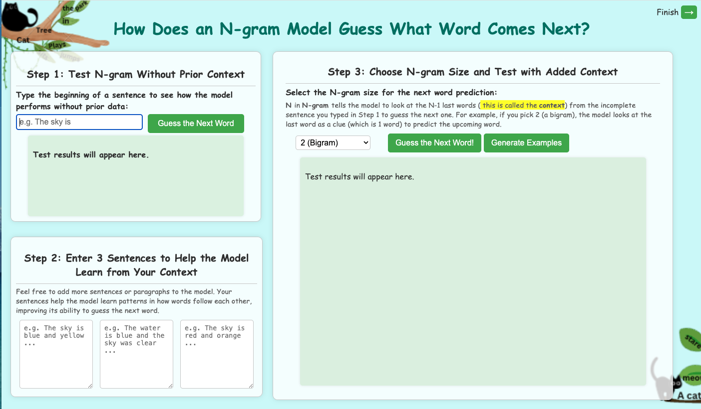
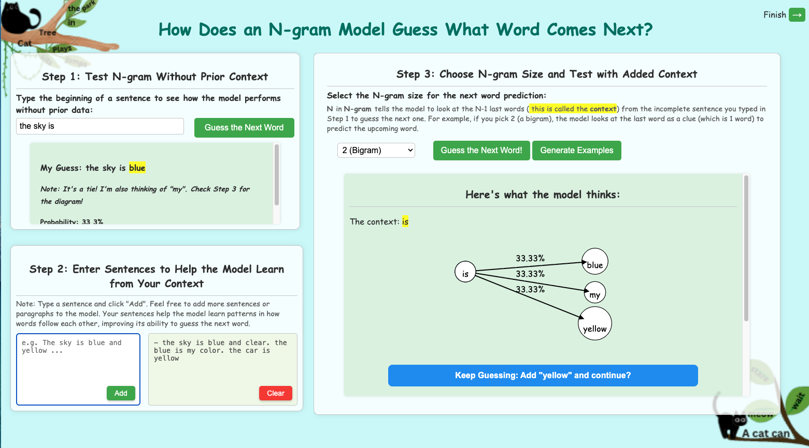

# Next Word Adventure

Next Word Adventure helps middle school students understand how predictive text models like n-grams work.

## [Live Demo](https://ngramadventure.pythonanywhere.com/)

## UI & UX Improvements

**Improved based on discussions with Prof. David Tourtzky.**

**Step 2 (Adding Context)** was redesigned for better intuition, flexibility, and visual clarity.

<table>
<tr>
  <td>
    **Before**<br>
    <small>Three fixed text boxes limited users to exactly three sentences and cluttered the layout.</small>
  </td>
  <td>
    **After**<br>
    <small>Single input + scrollable history with integrated controls and responsive spacing.</small>
  </td>
</tr>
<tr>
  <td></td>
  <td></td>
</tr>
</table>

**Key improvements:**

- Single input box + scrollable history for **unlimited training data**
- **Add** button lets students build datasets incrementally
- Step 1 now uses **entire saved history** for predictions (not just current inputs)

## Acknowledgments

Developed and piloted by **Saniya Vahedian Movahed** (Fall 2024).  
Thanks to **Hanif Vahedian Movahed** and **Rachel Chenard** for UI feedback.  
Supported by [AI Caring Institute](https://www.ai-caring.org/), **NSF Grant No. IIS-2112633**.

## Citation

```bibtex
@inproceedings{vahedian2025pre,
  title={From Pre-Conceptions to Theories: How Middle School Student Ideas about Predictive Text Evolve after Interaction with a New Software Tool},
  author={Vahedian Movahed, Saniya and Martin, Fred},
  booktitle={Proceedings of the Extended Abstracts of the CHI Conference on Human Factors in Computing Systems},
  pages={1--7},
  year={2025}
}
```
